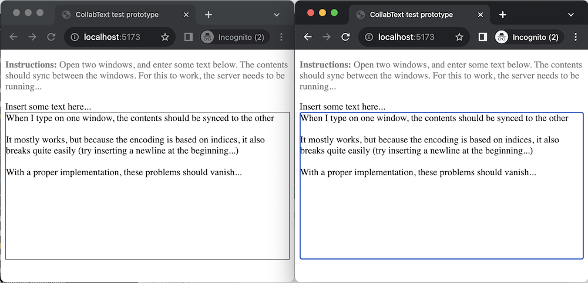

# collabtext-test

A few details:

- Uses Slate as a text editing component (https://docs.slatejs.org/)
- Chosen because it advertises a "Collaboration-ready data model", so thought that it might be simpler to set it up (listening for editor ops vs. diffing the contents)
- Sends native Slate [operations](https://docs.slatejs.org/concepts/05-operations) to a WebSockets server, which then broadcasts them to other clients
- This is a temporary solution: Slate's operations rely on indices, so they can break when sent over the wire
- In a proper implementation, this bit would be replaced by a CRDT-based scheme
